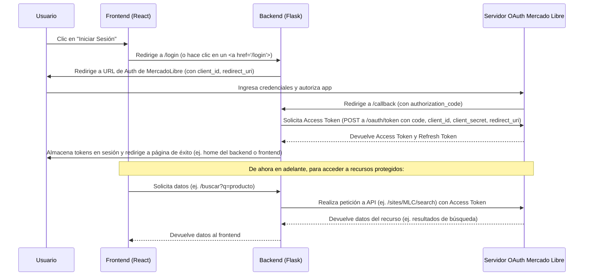

# Aplicación Web Full Stack - Motor de Recomendación Mercado Libre API

Esta aplicación es un motor de recomendación de productos que se integra con la API oficial de Mercado Libre Chile (`site_id = MLC`). Permite a los usuarios buscar productos, ver categorías y precios, utilizando los endpoints oficiales de Mercado Libre y autenticación OAuth2.

## Características

*   **Backend en Python (Flask):**
    *   Autenticación OAuth2 completa con Mercado Libre (obtención de `access_token` y `refresh_token`).
    *   Endpoint `/login` para iniciar el flujo de autenticación.
    *   Endpoint `/callback` para manejar la redirección de Mercado Libre.
    *   Endpoint `/buscar` para buscar productos en Mercado Libre Chile.
    *   Endpoint `/categorias` para obtener las categorías principales de Mercado Libre Chile.
    *   Manejo seguro de tokens (almacenados en sesión de servidor).
    *   Uso de variables de entorno para configuración sensible.
    *   Soporte CORS para permitir la comunicación con el frontend.
    *   Preparado para despliegue con Gunicorn (`Procfile`).
*   **Frontend en React:**
    *   Interfaz para buscar productos y visualizar resultados (nombre, imagen, precio, categoría).
    *   Botón para iniciar sesión a través del backend.
    *   Visualización de categorías principales.
    *   Comunicación con el backend para obtener datos.
    *   Muestra en consola el endpoint usado, método HTTP y JSON de respuesta para depuración.
    *   Configuración de URL del API backend mediante variables de entorno (`REACT_APP_API_BASE_URL`).
    *   Diseño visualmente atractivo y responsivo.

## Diagrama de Flujo OAuth2 (Simplificado)



## Configuración y Ejecución Local

### Prerrequisitos

*   Node.js y npm (o Yarn) para el frontend.
*   Python 3.x y pip para el backend.
*   Una aplicación creada en el [Centro de Desarrolladores de Mercado Libre](https://developers.mercadolibre.com/devcenter) para obtener:
    *   `Client ID`
    *   `Client Secret`
    *   `Redirect URI` (para desarrollo local, usa algo como `http://localhost:5000/callback` o `http://127.0.0.1:5000/callback`)

### Backend (Flask)

1.  **Clona el repositorio (si aún no lo has hecho):**
    ```bash
    git clone <tu-repositorio-url>
    cd <nombre-del-repositorio>/backend
    ```

2.  **Crea y activa un entorno virtual (recomendado):**
    ```bash
    python -m venv env
    source env/bin/activate  # En Windows: env\Scripts\activate
    ```

3.  **Instala las dependencias:**
    ```bash
    pip install -r requirements.txt
    ```

4.  **Configura las variables de entorno:**
    Crea un archivo `.env` en la carpeta `backend` (puedes copiar `backend/.env.example`):
    ```ini
    MELI_CLIENT_ID="TU_CLIENT_ID_DE_MERCADOLIBRE"
    MELI_CLIENT_SECRET="TU_CLIENT_SECRET_DE_MERCADOLIBRE"
    MELI_REDIRECT_URI="http://localhost:5000/callback" # Asegúrate que coincida con tu app MELI
    FLASK_SECRET_KEY="una_cadena_aleatoria_muy_segura_para_sesiones"
    ```
    Reemplaza los placeholders con tus credenciales reales.

5.  **Ejecuta el servidor Flask:**
    ```bash
    python app.py
    ```
    El backend estará corriendo en `http://localhost:5000`.

### Frontend (React)

1.  **Navega a la carpeta del frontend en otra terminal:**
    ```bash
    cd <nombre-del-repositorio>/frontend
    ```

2.  **Instala las dependencias:**
    ```bash
    npm install
    # o si usas yarn:
    # yarn install
    ```

3.  **Configura la URL del backend (opcional para desarrollo local si el backend corre en puerto 5000):**
    El frontend intentará conectarse a `http://localhost:5000` por defecto. Si tu backend corre en otro puerto/URL, crea un archivo `.env` en la carpeta `frontend` (puedes copiar `frontend/.env.example`):
    ```ini
    REACT_APP_API_BASE_URL=http://localhost:5000
    ```

4.  **Ejecuta la aplicación React:**
    ```bash
    npm start
    # o si usas yarn:
    # yarn start
    ```
    El frontend estará corriendo en `http://localhost:3000` (o el puerto que indique la consola).

### Probar el Sistema

1.  Asegúrate de que tanto el backend como el frontend estén corriendo.
2.  Abre tu navegador y ve a la URL del frontend (ej. `http://localhost:3000`).
3.  Haz clic en "Iniciar Sesión con Mercado Libre".
4.  Serás redirigido a Mercado Libre para autenticarte. Ingresa tus credenciales (de una cuenta de prueba si es posible).
5.  Autoriza la aplicación.
6.  Serás redirigido de vuelta. La interfaz del frontend debería indicar que estás autenticado o, al menos, permitirte usar las funciones de búsqueda. (Puede que necesites refrescar la página del frontend o navegar a ella manualmente si el redirect final del backend te deja en una página del backend).
7.  Prueba buscar productos y ver categorías.
8.  Revisa la consola del navegador para ver los logs de las peticiones (endpoint, método, JSON).

## Despliegue (General)

### Backend

*   La aplicación Flask está preparada para ser desplegada usando un servidor WSGI como Gunicorn (ver `Procfile` y `requirements.txt`).
*   Plataformas como Render, Heroku, o Google Cloud Run son adecuadas.
*   **Variables de entorno cruciales para producción:**
    *   `MELI_CLIENT_ID`
    *   `MELI_CLIENT_SECRET`
    *   `MELI_REDIRECT_URI` (DEBE ser la URL pública de tu backend desplegado + `/callback`).
    *   `FLASK_SECRET_KEY` (usa un valor fuerte y único).
    *   La configuración CORS en `backend/app.py` debe actualizarse para incluir el origen de tu frontend desplegado (ej. `https://tufrontend.vercel.app`).

### Frontend

*   Genera un build de producción: `npm run build` (dentro de la carpeta `frontend`).
*   Despliega la carpeta `frontend/build` en plataformas como Vercel, Netlify, o Render (como sitio estático).
*   **Variable de entorno crucial para producción:**
    *   `REACT_APP_API_BASE_URL` (debe ser la URL pública de tu backend desplegado).

**Importante:** Después de desplegar el backend, actualiza el `Redirect URI` en tu aplicación de Mercado Libre para que apunte a la URL de callback de producción.

## Estructura del Proyecto

```
.
├── backend/
│   ├── app.py              # Lógica principal de Flask, rutas, OAuth
│   ├── requirements.txt    # Dependencias de Python
│   ├── .env.example        # Ejemplo de variables de entorno para el backend
│   ├── Procfile            # Para despliegue (ej. Heroku, Render)
│   └── venv/ o env/        # Entorno virtual (ignorado por Git)
├── frontend/
│   ├── public/
│   │   └── index.html      # HTML principal de React
│   ├── src/
│   │   ├── App.js          # Componente principal de React, lógica del frontend
│   │   ├── App.css         # Estilos para App.js
│   │   └── ...
│   ├── node_modules/       # Dependencias de Node (ignorado por Git)
│   ├── package.json        # Dependencias y scripts de Node.js
│   ├── .env.example        # Ejemplo de variables de entorno para React
│   └── ...
├── .gitignore              # Archivos y carpetas a ignorar por Git
└── README.md               # Este archivo
```